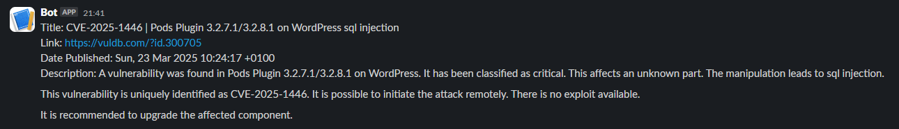

# Customized CVE FEED Scraper for vuldb.com

- This tool scrapes the CVE feed from [vuldb.com](https://vuldb.com/?), filters it based on keywords, and notifies via Slack about actionable CVEs that might affect the infrastructure.

## What it does?

- Parses the RSS feed from [vuldb.com](https://vuldb.com/?rss.recent) using [gofeed](https://github.com/mmcdole/gofeed).
- Filters the feed based on the defined keywords.
- Stores filtered CVEs in a database.
- Sends a Slack notification for each new CVE inserted into the database.

## How to use?

1. Set up keywords and Slack webhook in `config.yaml`:
```yaml
keywords:
- Floodlight
- wordpress
slackWebhook:
- https://hooks.slack.com/services/<id>/<id>
```

2. Run the tool on a regular interval (e.g., every few hours) to fetch the latest feeds and receive notifications for new CVEs.

## Slack Notification


## To-do

- [x] Fetch RSS feed from  https://vuldb.com/?rss.recent
- [x] Filter the feed if any keyword is present in the title
- [x] Store the data in a database if a keyword is found in the title
- [x] Send a Slack message if the insert operation is successful

## Enhancement & Refactoring

- [ ] Move the metadata to structure for easy parsing and shorter lines xD
